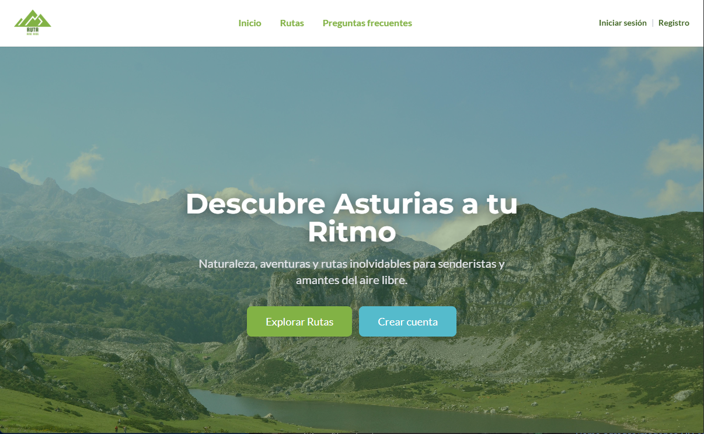
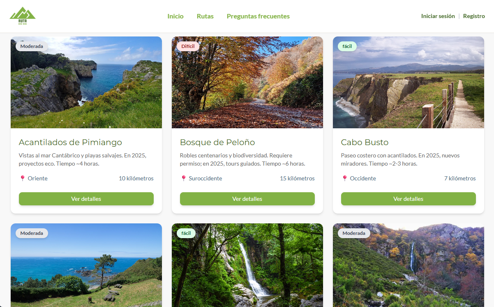
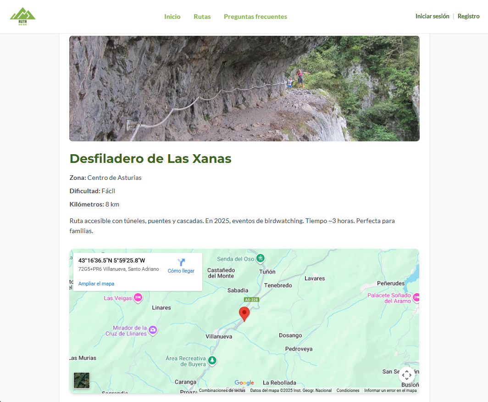
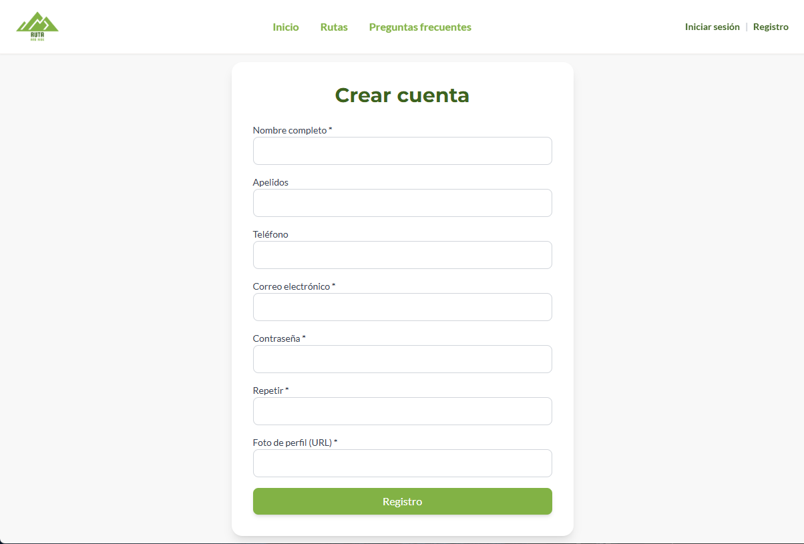
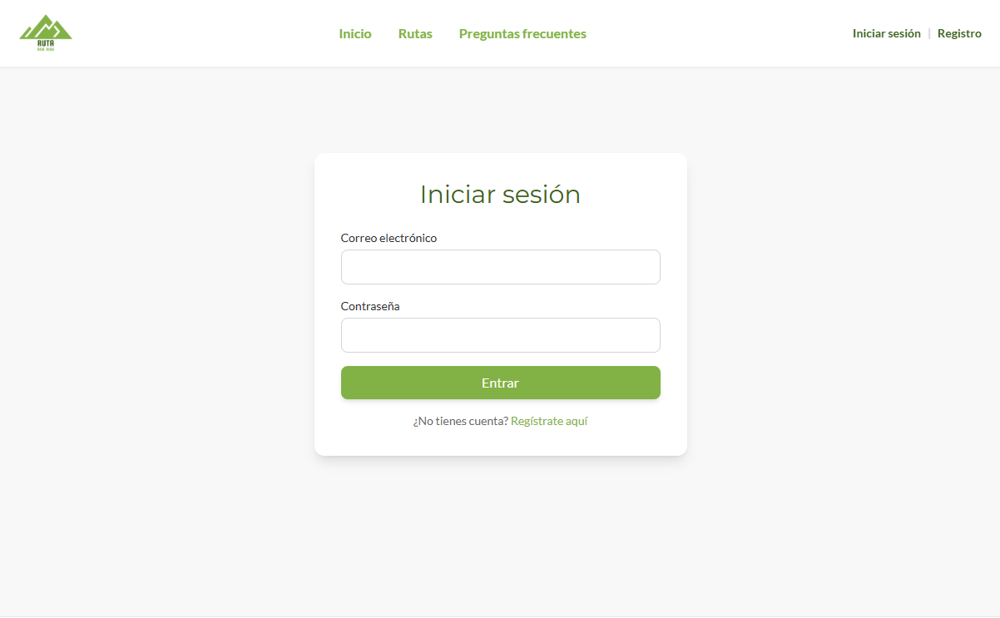

#  🌿 Asturias Ruta & Ride – Frontend

Aplicación web desarrollada con **React + Vite** que permite a los usuarios explorar rutas de senderismo por Asturias, consultar su detalle, registrarse, verificar su cuenta mediante correo electrónico y autenticarse con **JWT**.  
Este frontend se integra con la API del backend del mismo nombre.

---

##  1. Descripción del proyecto

El frontend proporciona una interfaz intuitiva y accesible para explorar rutas naturales de Asturias.  
Se conecta al backend para mostrar rutas en tiempo real, gestionar usuarios y validar el flujo completo de registro, verificación por correo e inicio de sesión.

El objetivo principal es ofrecer una experiencia visual y fluida, tanto para visitantes como para usuarios autenticados, conectando naturaleza y tecnología.

---

##  2. Características principales

- 🌄 Visualización dinámica de rutas desde el backend  
- 🗺️ Detalle completo de cada ruta (área, distancia, dificultad, imagen, descripción)  
- 🧑‍💻 Registro y autenticación con verificación por correo  
- 🔐 Gestión de sesión mediante **JWT** (persistente en `localStorage`)  
- ⚙️ Contexto global de autenticación con **AuthContext**  
- 🎨 Estilos responsivos con **TailwindCSS**  
- 💡 Preparado para integración con mapas y nuevas funcionalidades  

---

##  3. Tecnologías utilizadas

| Categoría      | Tecnología                |
|----------------|---------------------------|
| Framework      | React 19 + Vite           |
| Estilos        | TailwindCSS               |
| Router         | react-router-dom          |
| Formularios    | react-hook-form           |
| Mapas          | Leaflet + react-leaflet   |
| Estado global  | React Context API         |
| Testing        | Vitest + Testing Library  |
| Linter         | ESLint                    |

---

##  4. Arquitectura del proyecto

Estructura modular, limpia y escalable:

```
src/
├── components/ # Componentes reutilizables (Header, UI, etc.)
├── context/ # AuthContext y provider
├── pages/ # Vistas principales (Home, Register, Login, etc.)
│ ├── auth/ # Páginas de autenticación
│ └── routes/ # Páginas relacionadas a rutas
├── services/ # Lógica de comunicación con el backend (HTTP fetch)
├── hooks/ # Custom hooks 
├── assets/ # Imágenes, fuentes, iconos
├── App.jsx # Configuración de rutas
└── main.jsx # Render principal
```
---


##  5. Instalación y ejecución

###  Requisitos previos

- Node.js 18+
- npm o yarn
- Tener el backend corriendo localmente (recomendado en puerto 8080)

###  Instalación

```bash
npm install
```

###  Ejecutar en desarrollo

```bash
npm run dev
```

La aplicación estará disponible en:
http://localhost:5173

---

## 🔑 6. Variables de entorno

Crear un archivo `.env` en la raíz del proyecto para configurar el endpoint del backend:

```env
VITE_API_URL=http://localhost:8080/api/v1
```

En el código, se accede como:

```bash
import.meta.env.VITE_API_URL
```

---

##  7. Navegación y vistas

| Ruta            | Página           | Descripción                                     |
|-----------------|------------------|-------------------------------------------------|
| `/home`         | HomePage         | Página inicial de presentación                 |
| `/routes`       | RoutesPage       | Listado de rutas obtenidas del backend     |
| `/routes/:id`   | RouteDetailPage  | Detalle de cada ruta                            |
| `/register`     | RegisterPage     | Formulario de registro                          |
| `/verify-email` | VerifyEmailPage  | Confirmación del token recibido por correo         |
| `/login`        | LoginPage        | Inicio de sesión con JWT                           |

---

##  8. Comunicación con el backend

La comunicación se realiza mediante `fetch` utilizando los endpoints del backend.


```js
const res = await fetch(`${import.meta.env.VITE_API_URL}/routes`);
```

El token JWT se almacena en `localStorage` y se gestiona mediante **AuthContext**.

---

##  9. Testing

Tests básicos implementados con **Vitest + Testing Library**.

**Ejecutar los tests:**

```bash
npm run test
```

**Modo visual:**

```bash
npm run test:ui
```

---

##  10. Roadmap y mejoras pendientes

🗺️ Integración de mapas con Leaflet

⭐ Favoritos por usuario

🔐 Protección de rutas según rol o autenticación

📱 Modo oscuro y diseño responsive completo

❓ Página de Preguntas Frecuentes (FAQ)

🌍 Internacionalización (ES/EN)

⚠️ Página 404 personalizada

---

## 🌈 11. Demo & Presentación

| Pantalla | Vista |
|----------|--------|
| Home |  |
| Listado de Rutas |  |
| Detalle de Ruta |  |
| Register |  |
| Login | 


> 🎬 [**Presentación completa en Canva](https://www.canva.com/design/DAG33nGWu-M/vWakPaQiWbtmhJTmKPBihA/edit?utm_content=DAG33nGWu-M&utm_campaign=designshare&utm_medium=link2&utm_source=sharebutton)  

---

## 🎨 12. Paleta de colores del diseño

| Propósito | HEX |
|-----------|-------|
| Verde principal | `#82B245` |
| Verde oscuro | `#3C631F` |
| Azul acento | `#55BBCC` |
| Rojo acento | `#D9534F` |
| Fondo claro | `#F8F8F8` |
| Fondo alternativo | `#F4F1EE` |
| Texto principal | `#2E2E2E` |
| Texto secundario | `#4A6981` |
| Texto tenue |  `#6A6A6A` |

---

## ✨ 13. Autoría

Proyecto desarrollado como parte del bootcamp **Full Stack Developer** - **Factoría F5 Asturias**.
Integración completa con el backend **Asturias Ruta & Ride.**

**Autora:** Milca Ponce
📧 Contacto: milcaponce.dev@gmail.com

---


